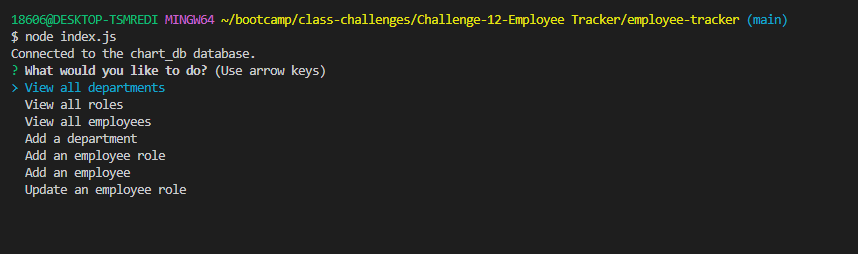

# Employee Tracker
## Description
This application allows non-developers to easily view and interact with information stored in an employee database.

Click the image below to see a demo of the application.

## Table of Contents
- [Description](#description)
- [Installation](#installation)
- [Usage](#usage)
- [Contributing](#contributing)
- [Questions](#questions)

## Installation
In order to install inquirer, express, mysql2, and console.table, please use:  
npm i

## Usage
As a developer, I want non-developers to be able to view and manage an employee database with departments, roles, and employees in a company so that they can organize and plan their business.

The application will be invoked by using the following command: 
node index.js

## Contributing
Thank you for your interest in my project. I am excited to see your contributions. Please follow the [Contributor Covenant](https://www.contributor-covenant.org/).

## Questions
If you have additional questions, please email me at bsimmonds28@gmail.com.
To see more of my work, find me on GitHub at [bsimmonds28](https://github.com/bsimmonds28)!
